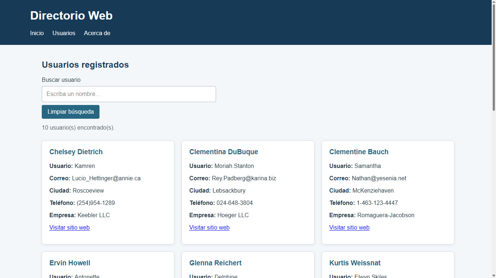
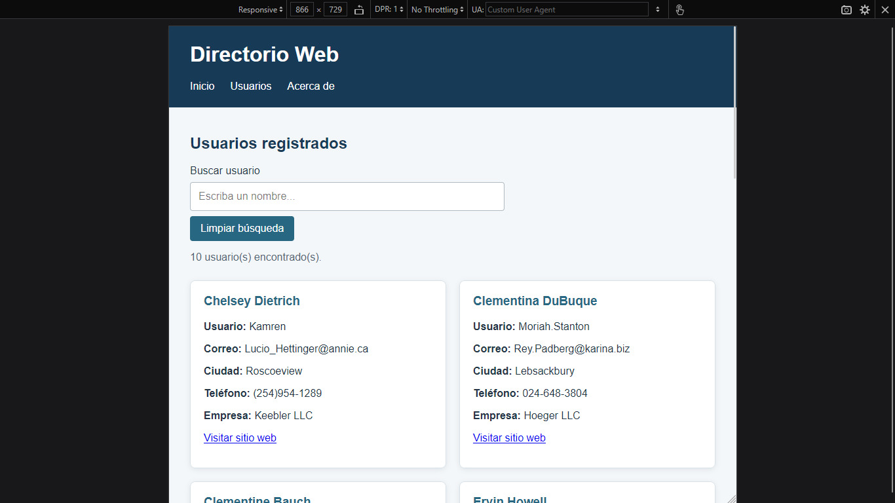
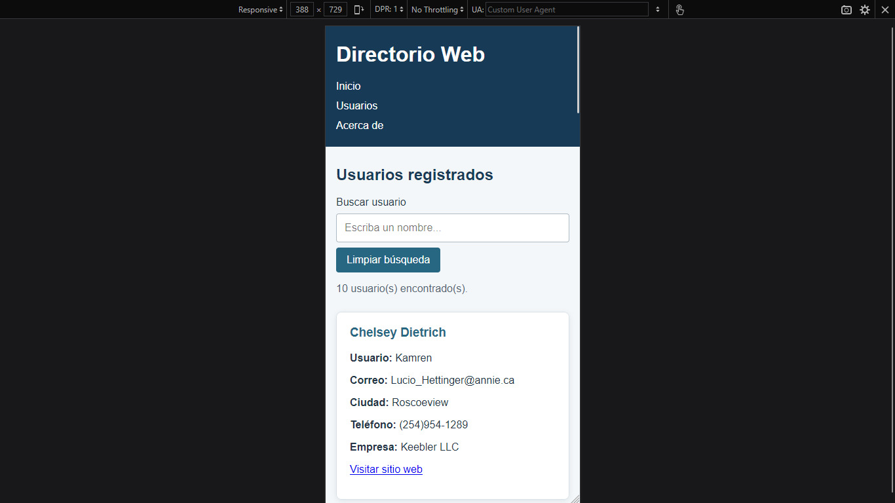

# Directorio Web

Miniaplicación desarrollada para la guía práctica de Programación Web. Permite consultar usuarios desde una API pública, mostrarlos en tarjetas y buscarlos desde una interfaz responsive.

## Tecnologías

- HTML semántico
- CSS, Flexbox y Grid
- JavaScript y manipulación del DOM
- Fetch API

## API utilizada

La aplicación consume los datos de usuarios desde:

`https://jsonplaceholder.typicode.com/users`

## Funcionalidades

- Carga de usuarios desde la API.
- Mensaje visible durante la carga y cuando ocurre un error.
- Tarjetas con nombre, usuario, correo, ciudad, teléfono, empresa y sitio web.
- Orden alfabético por nombre.
- Búsqueda por nombre, correo o ciudad.
- Mensaje cuando no existen resultados.
- Botón para limpiar la búsqueda.
- Diseño responsive para escritorio, tableta y móvil.

## Estructura del proyecto

```text
guia-fetch-01/
├── index.html
├── css/
│   └── styles.css
├── js/
│   └── app.js
├── capturas/
│   ├── escritorio.jpg
│   ├── escritorio busqueda.jpg
│   ├── tableta.jpg
│   └── movil.jpg
└── README.md
```

## Ejecución

1. Clonar o descargar el repositorio.
2. Abrir la carpeta en Visual Studio Code.
3. Abrir `index.html` en un navegador o utilizar la extensión Live Server.
4. Escribir en el buscador para filtrar los usuarios.

Se necesita conexión a Internet para consultar la API.

## Evidencia visual

### Vista de escritorio



### Búsqueda de usuarios


### Vista de tableta



### Vista móvil


